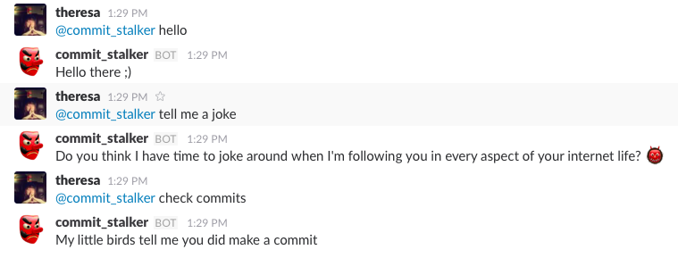

# Commit *STALKER*
# (http://commit-stalker.heroku.com)[http://commit-stalker.heroku.com]

Commit Tracker is a full-stack web application that checks if members of a team have made a github commit everyday. It also has a slack-bot to message specific users who haven't committed yet that day. Built in line with the 30 day github challenge sprint.

To-Do list:
- ability to change github username
- a usable front end
- timer function
- team functionality
- create a working travis.yml
- build and edit teams

